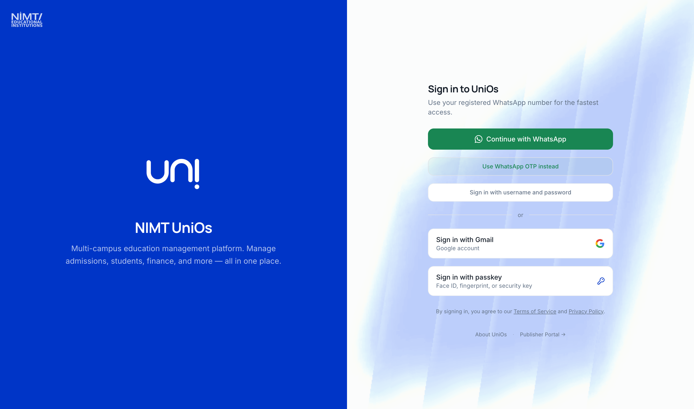
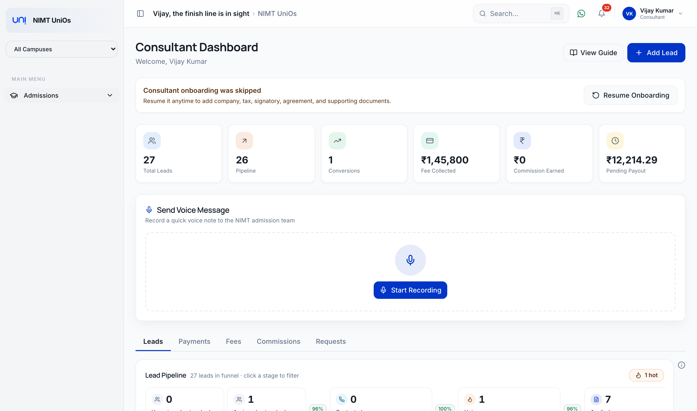
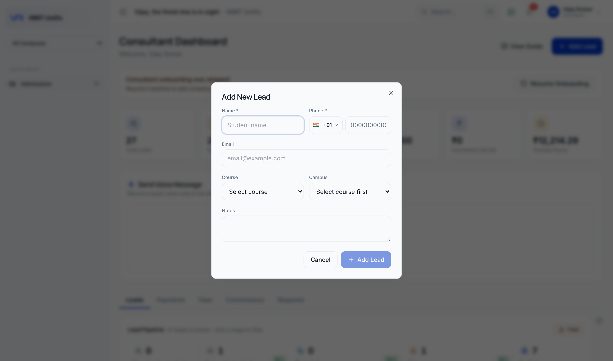
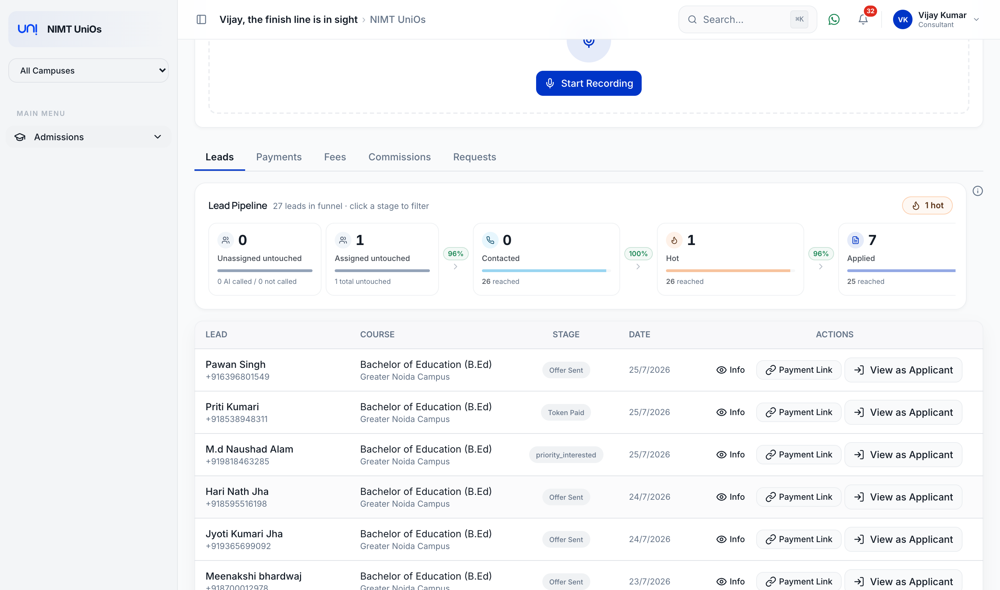
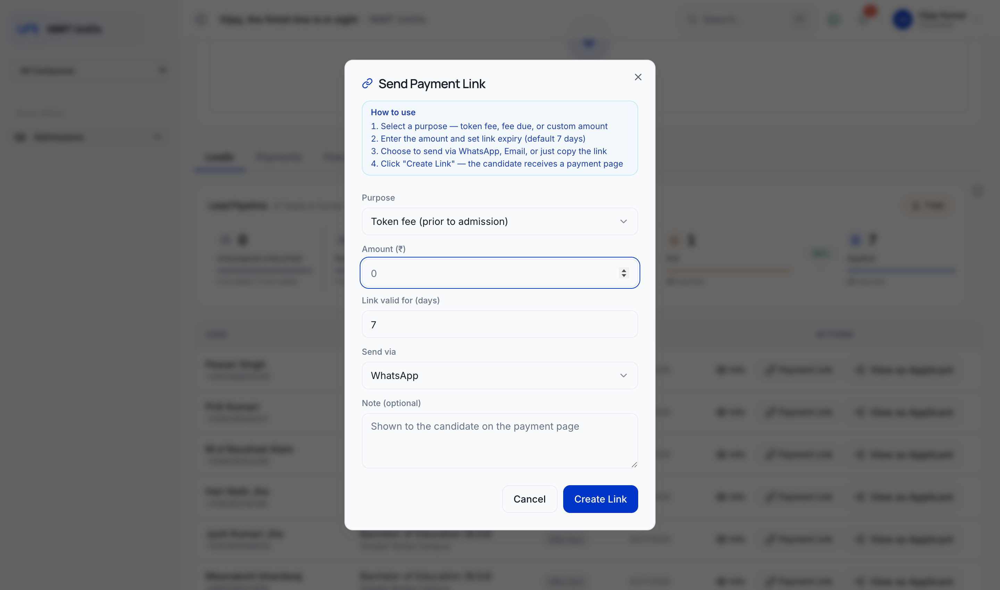
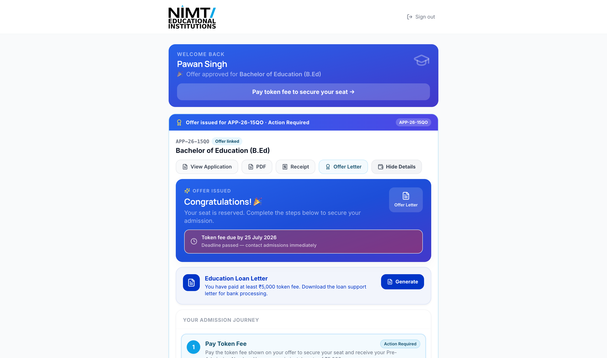
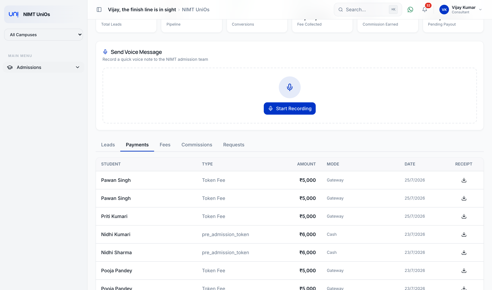
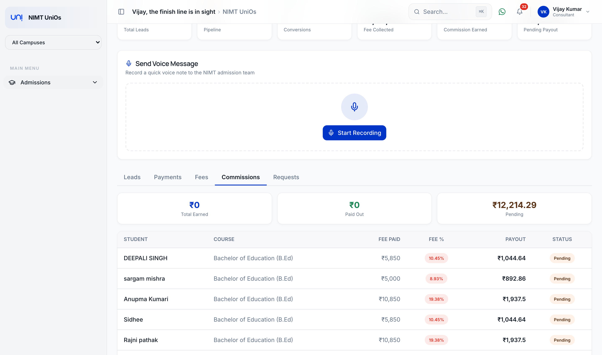
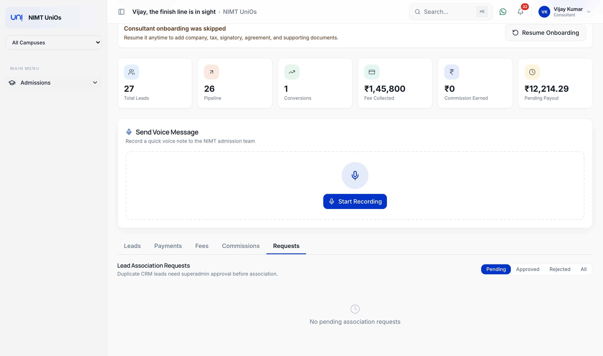

# NIMT Consultant Portal — User Guide

Your complete handbook to using the consultant portal at **https://uni.nimt.ac.in**.

> **Screenshots:** Images live in `docs/img/consultant/`. If an image looks missing,
> save the matching screenshot into that folder using the filename shown under each image.

---

## 1. Logging In

Go to **https://uni.nimt.ac.in**. On the sign-in screen, click **Sign in with username
and password** and enter your registered consultant email and password.

- You can also sign in with **WhatsApp OTP** — click **Continue with WhatsApp**.
- Forgot your password? Click **Forgot Password** on the login screen.
- Account issues → email `admissions@nimt.ac.in` or your assigned NIMT representative.

Once you sign in, you land directly on your **Consultant Dashboard**. In the sidebar you
have two items under **Admissions**: **Courses & Fees** and **My Leads** (your dashboard).

*`01-login.png` — Sign in to UniOs page*

> If you see *"No consultant profile linked to your account,"* your login isn't yet
> attached to a consultant record — contact the admission team.

---

## 2. Your Consultant Dashboard

The top shows **Consultant Dashboard** with **Welcome, {your name}** and two buttons on
the right: **View Guide** and **Add Lead**.

Six stat cards summarise your performance:

| Card | Meaning |
|------|---------|
| **Total Leads** | Students you've added |
| **Pipeline** | Leads currently in progress (not yet admitted/rejected) |
| **Conversions** | Leads who have been admitted |
| **Fee Collected** | Total fees paid by your admitted students |
| **Commission Earned** | Your total earnings from successful conversions |
| **Pending Payout** | Commission still to be paid out to you |

Below the stats are the **Send Voice Message** widget and five tabs:
**Leads · Payments · Fees · Commissions · Requests**.

*`02-dashboard.png` — Dashboard header, six stat cards, voice widget*

### First-time onboarding

On first use, an onboarding card walks you through four steps —
**Company → Tax → Signatory → Documents** — where you upload your Consultant
Agreement (required) and other documents (PAN, GST, TAN, bank details, etc.).
Use **Save Draft** to pause, **Save & Continue** to advance, and **Complete
Onboarding** to finish. You can **Skip for now** and later click **Resume Onboarding**.

---

## 3. Adding a New Lead

Click **Add Lead** (top right). The **Add New Lead** dialog opens:

- **Name** \* — student's full name
- **Phone** \* — 10-digit number (country code defaults to +91)
- **Email** — optional but recommended
- **Course** — pick from the dropdown (grouped by department)
- **Campus** — auto-filtered based on the course you choose (*"Select course first"*)
- **Notes** — anything the admission team should know

Click **Add Lead** to submit (the button stays disabled until name and phone are filled).

- If the phone number is **new**, you'll see **"Lead added"** and it appears in your
  pipeline immediately.
- If the phone number **already exists** in the CRM, you'll see **"Duplicate sent for
  approval"** — the lead becomes yours only after a super admin approves it. Track it in
  the **Requests** tab.

*`03-add-lead.png` — "Add New Lead" dialog*

---

## 4. The Leads Tab — Your Pipeline

The **Leads** tab shows a **Lead Pipeline** funnel and a table of your leads. Click any
stage in the funnel to filter the table to that stage. The info (ⓘ) icon opens a
**How the pipeline works** popover.

Each lead row has three actions:

- **Info** (eye icon) — opens the Course Information for that lead.
- **Payment Link** (link icon) — create and send a payment link (see §5).
- **View as Applicant** — open the application form as that student (see §6).

*`04-leads-tab.png` — Pipeline funnel + leads table with the three row actions*

### Lead stages

New Lead → App In Progress → Fee Paid → Submitted → AI Called → In Follow Up →
Visit Scheduled → Interview → Offer Sent → Token Paid → Pre-Admitted → **Admitted**
(commission becomes payable). Other stages: Waitlisted, Rejected, Ineligible,
Do Not Contact, Deferred (Next Session).

---

## 5. Sending a Payment Link

From the **Leads** tab, click the **Payment Link** button on a lead's row. The
**Send Payment Link** dialog opens with a "How to use" summary at the top.

Fill in:

- **Purpose** — choose one:
  - *Token fee (prior to admission)* — the default for a lead
  - *Fee due*
  - *Custom amount*
- **Amount (₹)** — the amount to collect (must be greater than 0).
- **Link valid for (days)** — defaults to **7**.
- **Send via** — how the student receives it:
  - *Don't send — just create the link* (you copy and share it yourself)
  - *WhatsApp* (default)
  - *Email*
  - *WhatsApp + Email*
- **Note (optional)** — a short message shown to the student on the payment page.

Click **Create Link**. On success you'll see **"Payment link created"** and the link
appears with a **copy** button; click **Done** to close. When the payment gateway is
configured, the student pays on a secure hosted page, and the lead's stage and fees
update automatically once paid.

*`05-payment-link.png` — "Send Payment Link" dialog*

---

## 6. Getting the Application Filled ("View as Applicant")

To help a student complete their application, click **View as Applicant** on the lead's
row in the **Leads** tab. This opens the **apply portal in a new tab as that student**,
using a secure link valid for 24 hours.

From the apply portal you can fill in / continue the student's application, view the
submitted application (**View Application**), download the **PDF**, **Receipt**, or
**Offer Letter**, and — once an offer is issued — use **Pay token fee to secure your
seat**. Progress reflects back on the lead's stage (e.g. *App In Progress → Submitted →
Offer Sent*).

*`06-view-as-applicant.png` — Apply portal opened via "View as Applicant"*

---

## 7. Payments, Fees & Commissions

**Payments tab** — every payment made by your students: **Student, Type, Amount, Mode,
Date**, with a **download** icon per row to grab the receipt PDF.

*`07-payments-tab.png` — Payments table with receipt download*

**Fees tab** — the detailed fee panel for your students.

**Commissions tab** — three cards (*Total Earned*, *Paid Out*, *Pending*) plus a payout
table: **Student, Course, Fee Paid, Fee %, Payout, Status**. Statuses move
**Pending → Approved → Paid** (or *Cancelled*).

> **Payout rule:** commission payouts are released proportionally to student fee
> payments. A student must have paid at least **25% of their annual fee** before your
> commission on them is eligible for payout.

*`08-commissions-tab.png` — Summary cards + payout table*

---

## 8. Requests Tab

When you add a lead whose phone number already exists in the CRM, it becomes a
**Lead Association Request** shown here (filters: **Pending / Approved / Rejected / All**).
A super admin reviews and approves it before the lead counts as yours.

*`09-requests-tab.png` — Lead Association Requests*

---

## 9. Sending a Voice Message to the Admission Team

Need a quick answer? Use the **Send Voice Message** widget on your dashboard:

1. Click **Start Recording**.
2. Allow microphone access when your browser prompts.
3. Speak clearly, then **Stop** — play it back to check it.
4. Add an optional subject line and send it to the admission team.

The NIMT super admin and principal get an instant notification and respond as soon as
possible.

---

## 10. Need Help?

- **Email:** `admissions@nimt.ac.in`
- **Phone:** your assigned NIMT representative
- **Fastest response:** the in-app voice message feature

Thank you for being part of the NIMT Educational Institutions family.

---

### Screenshot filename map

Save each image from the walkthrough into `docs/img/consultant/`:

| File | Screen |
|------|--------|
| `01-login.png` | Sign in to UniOs |
| `02-dashboard.png` | Consultant Dashboard (stats + tabs) |
| `03-add-lead.png` | Add New Lead dialog |
| `04-leads-tab.png` | Leads tab — pipeline + table |
| `05-payment-link.png` | Send Payment Link dialog |
| `06-view-as-applicant.png` | Apply portal (View as Applicant) |
| `07-payments-tab.png` | Payments tab |
| `08-commissions-tab.png` | Commissions tab |
| `09-requests-tab.png` | Requests tab |
